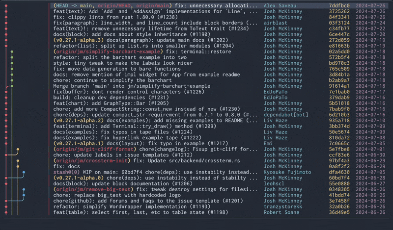
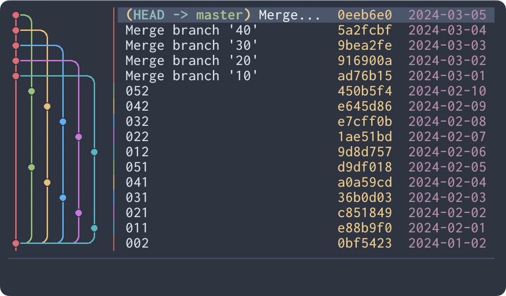
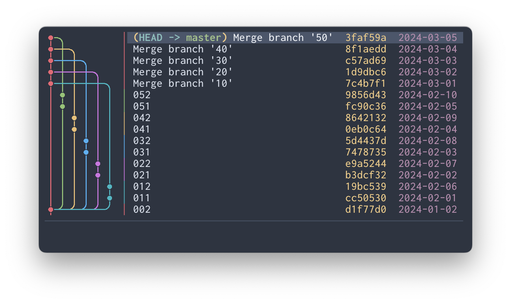
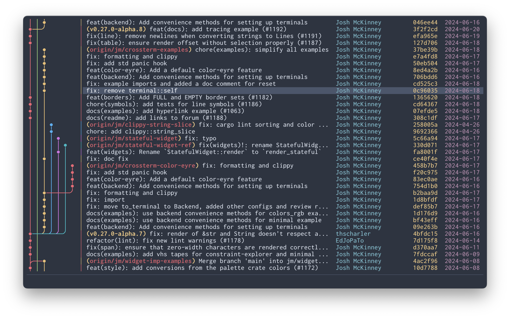
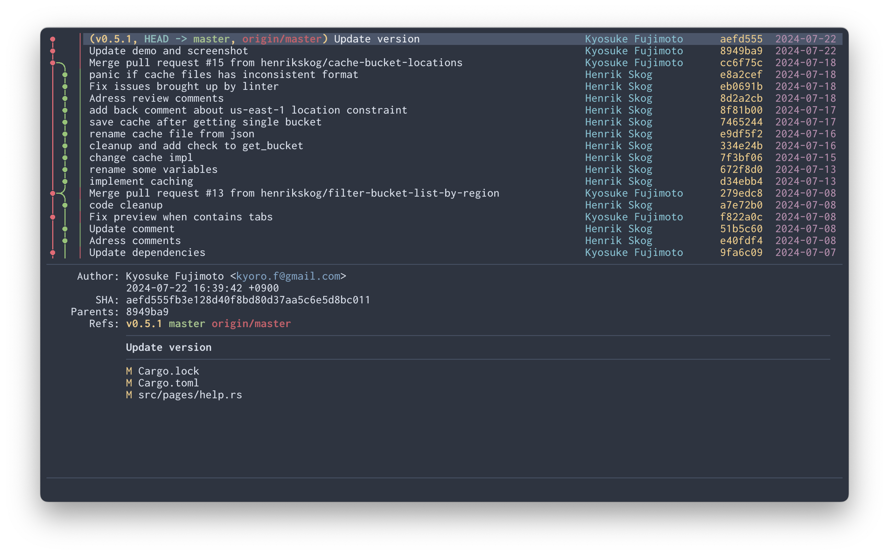
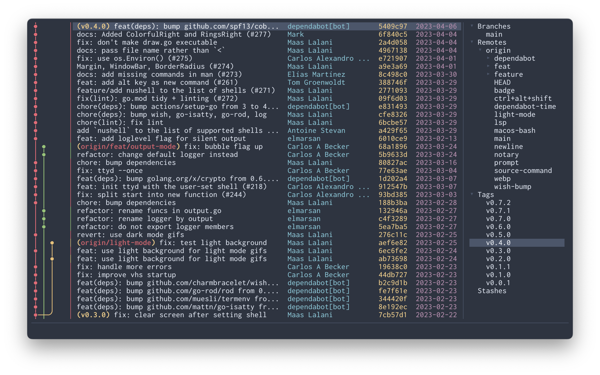
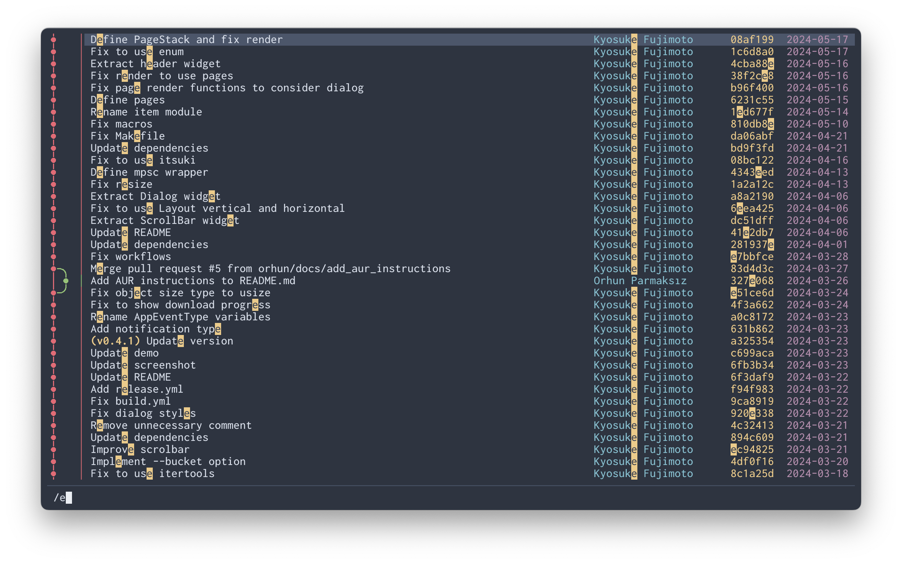
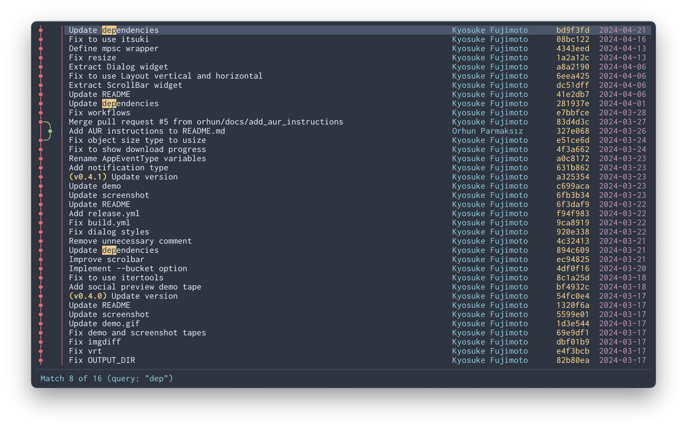

# Serie

[](https://crates.io/crates/serie)

A rich git commit graph in your terminal, like magic 📚



(This demo shows [Ratatui](https://github.com/ratatui-org/ratatui) repository!)

## About

Serie (`/zéːriə/`) is a TUI application that uses the terminal emulators' image display protocol to render commit graphs like `git log --graph --all`.

### Why?

While some users prefer to use Git via CLI, they often rely on a GUI or feature-rich TUI to view commit logs. Others may find `git log --graph` sufficient.

Personally, I found the output from `git log --graph` difficult to read, even with additional options. Learning complex tools just to view logs seemed cumbersome.

### Goals

- Provide a rich `git log --graph` experience in the terminal.
- Offer commit graph-centric browsing of Git repositories.

### Non-Goals

- Implement a fully-featured Git client.
- Create a TUI application with a complex UI.

## Requirements

- Git
- Supported terminal emulator
  - Refer to [Compatibility](#compatibility) for details.

## Installation

### Cargo

```
$ cargo install --locked serie
```

### Arch Linux

```
$ pacman -S serie
```

### Homebrew (macOS)

```
$ brew install lusingander/tap/serie
```

### Downloading binary

You can download pre-compiled binaries from [releases](https://github.com/lusingander/serie/releases).

### Build from source

If you want to check the latest development version, build from source:

```
$ git clone https://github.com/lusingander/serie.git
$ cd serie
$ cargo build --release
$ ./target/release/serie
```

> [!NOTE]
> Unless it's a release build, it's very slow.

## Usage

### Basic

Run `serie` in the directory where your git repository exists.

```
$ cd <your git repository>
$ serie
```

### Options

```
Serie - A rich git commit graph in your terminal, like magic 📚

Usage: serie [OPTIONS]

Options:
  -p, --protocol <TYPE>  Image protocol to render graph [default: auto] [possible values: auto, iterm, kitty]
  -o, --order <TYPE>     Commit ordering algorithm [default: chrono] [possible values: chrono, topo]
      --no-cache         Do not use graph image cache
  -h, --help             Print help
  -V, --version          Print version
```

#### -p, --protocol \<TYPE\>

A protocol type for rendering images of commit graphs.
By default `auto` will guess the best supported protocol for the current terminal.
Kitty terminals are detected as `kitty` via an environment variable, and all others are assumed to support `iterm`.

Refer to [Compatibility](#compatibility) for details.

#### -o, --order \<TYPE\>

`--order chrono` will order commits by commit date if possible.



`--order topo` will order commits on the same branch consecutively if possible.



#### --no-cache

The generated graph image is saved in `$XDG_CACHE_HOME/serie` and reused.
If `$XDG_CACHE_HOME` is not set, `~/.cache/` will be used instead.

If `--no-cache` is specified, this cache image will not be used or saved.

### Keybindings

You can see the keybindings by pressing the `?` key.

The default key bindings can be overridden. Please refer to [default-keybind.toml](./assets/default-keybind.toml) and add it to [config.toml](#config).

<details>
<summary>List of all default keybindings</summary>

#### Common

| Key                            | Description | Corresponding keybind |
| ------------------------------ | ----------- | --------------------- |
| <kbd>Ctrl-c</kbd> <kbd>q</kbd> | Quit app    | `force_quit` `quit`   |
| <kbd>?</kbd>                   | Open help   | `help_toggle`         |

#### Commit List

| Key                               | Description                                        | Corresponding keybind                        |
| --------------------------------- | -------------------------------------------------- | -------------------------------------------- |
| <kbd>Down/Up</kbd> <kbd>j/k</kbd> | Move down/up                                       | `navigate_down` `navigate_up`                |
| <kbd>g/G</kbd>                    | Go to top/bottom                                   | `go_to_top` `go_to_bottom`                   |
| <kbd>Ctrl-f/b</kbd>               | Scroll page down/up                                | `page_down` `page_up`                        |
| <kbd>Ctrl-d/u</kbd>               | Scroll half page down/up                           | `half_page_down` `half_page_up`              |
| <kbd>H/M/L</kbd>                  | Select top/middle/bottom of the screen             | `select_top` `select_middle` `select_bottom` |
| <kbd>Enter</kbd>                  | Show commit details<br>Apply search (if searching) | `confirm`                                    |
| <kbd>Tab</kbd>                    | Open refs list                                     | `ref_list_toggle`                            |
| <kbd>/</kbd>                      | Start search                                       | `search`                                     |
| <kbd>Esc</kbd>                    | Cancel search                                      | `cancel`                                     |
| <kbd>n/N</kbd>                    | Go to next/previous search match                   | `go_to_next` `go_to_previous`                |
| <kbd>c/C</kbd>                    | Copy commit short/full hash                        | `short_copy` `full_copy`                     |

#### Commit Detail

| Key                                 | Description                 | Corresponding keybind         |
| ----------------------------------- | --------------------------- | ----------------------------- |
| <kbd>Esc</kbd> <kbd>Backspace</kbd> | Close commit details        | `close` `cancel`              |
| <kbd>Down/Up</kbd> <kbd>j/k</kbd>   | Scroll down/up              | `navigate_down` `navigate_up` |
| <kbd>g/G</kbd>                      | Go to top/bottom            | `go_to_top` `go_to_bottom`    |
| <kbd>c/C</kbd>                      | Copy commit short/full hash | `short_copy` `full_copy`      |

#### Refs List

| Key                                                | Description      | Corresponding keybind              |
| -------------------------------------------------- | ---------------- | ---------------------------------- |
| <kbd>Esc</kbd> <kbd>Backspace</kbd> <kbd>Tab</kbd> | Close refs list  | `close` `cancel` `ref_list_toggle` |
| <kbd>Down/Up</kbd> <kbd>j/k</kbd>                  | Move down/up     | `navigate_down` `navigate_up`      |
| <kbd>g/G</kbd>                                     | Go to top/bottom | `go_to_top` `go_to_bottom`         |
| <kbd>Right/Left</kbd> <kbd>l/h</kbd>               | Open/Close node  | `navigate_right` `navigate_left`   |
| <kbd>c</kbd>                                       | Copy ref name    | `short_copy`                       |

#### Help

| Key                                              | Description      | Corresponding keybind          |
| ------------------------------------------------ | ---------------- | ------------------------------ |
| <kbd>Esc</kbd> <kbd>Backspace</kbd> <kbd>?</kbd> | Close help       | `close` `cancel` `help_toggle` |
| <kbd>Down/Up</kbd> <kbd>j/k</kbd>                | Scroll down/up   | `navigate_down` `navigate_up`  |
| <kbd>g/G</kbd>                                   | Go to top/bottom | `go_to_top` `go_to_bottom`     |

</details>

### Config

Config files are loaded in the following order of priority:

- `$SERIE_CONFIG_FILE`
  - If `$SERIE_CONFIG_FILE` is set but the file does not exist, an error occurs.
- `$XDG_CONFIG_HOME/serie/config.toml`
  - If `$XDG_CONFIG_HOME` is not set, `~/.config/` will be used instead.

If the config file does not exist, the default values will be used for all items.
If the config file exists but some items are not set, the default values will be used for those unset items.

#### Config file format

The values set in this example are the default values.

```toml
[ui.list]
# The minimum width of a subject in the commit list.
# type: u16
subject_min_width = 20
# The date format of a author date in the commit list.
# The format must be specified in strftime format.
# https://docs.rs/chrono/latest/chrono/format/strftime/index.html
# type: string
date_format = "%Y-%m-%d"
# The width of a author date in the commit list.
# type: u16
date_width = 10
# Whether to show a author date in the commit list in local timezone.
# type: boolean
date_local = true
# The width of a author name in the commit list.
# type: u16
name_width = 20

[ui.detail]
# The date format of a author/committer date in the commit detail.
# The format must be specified in strftime format.
# https://docs.rs/chrono/latest/chrono/format/strftime/index.html
# type: string
date_format = "%Y-%m-%d %H:%M:%S %z"
# Whether to show a author/committer date in the commit list in local timezone.
# type: boolean
date_local = true

[keybind]
# See ./assets/default-keybind.toml for a specific example configuration.
# ...
```

## Compatibility

### Supported terminals

These image protocols are supported:

- [Inline Images Protocol (iTerm2)](https://iterm2.com/documentation-images.html)
- [Terminal graphics protocol (kitty)](https://sw.kovidgoyal.net/kitty/graphics-protocol/)

The terminals on which each has been confirmed to work are listed below.

#### Inline Images Protocol

| Terminal emulator                                                                | Support | Note                                                                                                                                         |
| -------------------------------------------------------------------------------- | ------- | -------------------------------------------------------------------------------------------------------------------------------------------- |
| [iTerm2](https://iterm2.com)                                                     | ○       | But slower than other terminals                                                                                                              |
| [WezTerm](https://wezfurlong.org/wezterm/index.html)                             | ○       |                                                                                                                                              |
| [VSCode integrated terminal](https://code.visualstudio.com/docs/terminal/basics) | ○       | Requires the [`terminal.integrated.enableImages` setting](https://code.visualstudio.com/docs/terminal/advanced#_image-support) to be enabled |
| [Hyper](https://hyper.is)                                                        | △       | >=[v4.0.0](https://github.com/vercel/hyper/releases/tag/v4.0.0-canary.4), not yet officially released                                        |
| [Tabby](https://tabby.sh)                                                        | △       | The graph background is not transparent                                                                                                      |

#### Terminal graphics protocol

| Terminal emulator                         | Support | Note |
| ----------------------------------------- | ------- | ---- |
| [kitty](https://sw.kovidgoyal.net/kitty/) | ○       |      |

### Reporting Compatibility

Please share your experience with other terminal emulators on the [Discussions](https://github.com/lusingander/serie/discussions/29).

## Contributing

To get started with contributing, please review [CONTRIBUTING.md](CONTRIBUTING.md).

Contributions that do not follow these guidelines may not be accepted.

## Screenshots







The following repositories are used as these examples:

- [ratatui-org/ratatui](https://github.com/ratatui-org/ratatui)
- [charmbracelet/vhs](https://github.com/charmbracelet/vhs)
- [lusingander/stu](https://github.com/lusingander/stu)

## License

MIT
