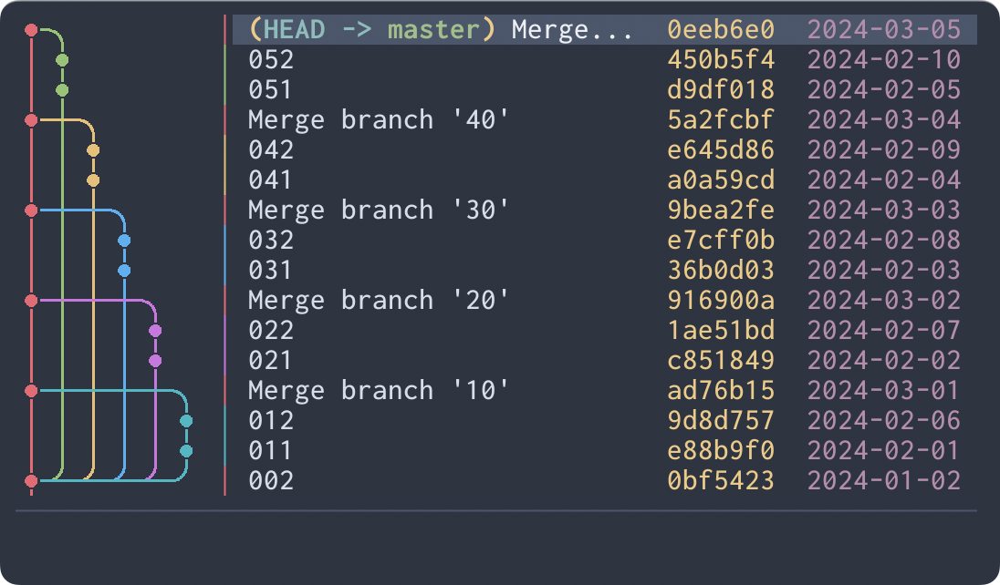
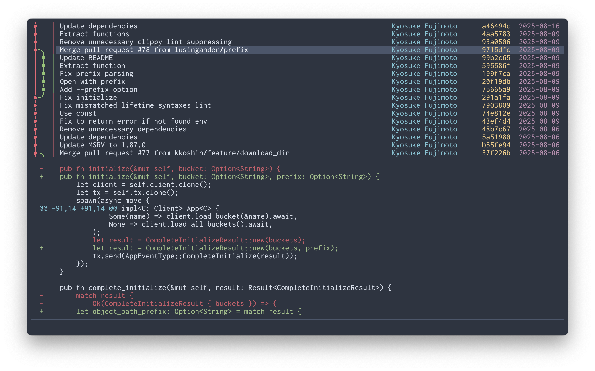

# Serie

[](https://crates.io/crates/serie)
[](https://ratatui.rs)

A rich git commit graph in your terminal, like magic 📚


(This demo shows [Ratatui](https://github.com/ratatui/ratatui) repository!)

## About

Serie (`/zéːriə/`) is a TUI application that uses the terminal emulators' image display protocol to render commit graphs like `git log --graph --all`.

### Why?

While some users prefer to use Git via CLI, they often rely on a GUI or feature-rich TUI to view commit logs. Others may find `git log --graph` sufficient.

Personally, I found the output from `git log --graph` difficult to read, even with additional options. Learning complex tools just to view logs seemed cumbersome.

### Goals

- Provide a rich `git log --graph` experience in the terminal.
- Offer commit graph-centric browsing of Git repositories.

### Non-Goals

- Implement a fully-featured Git client.
- Create a TUI application with a complex UI.
- Works in any terminal environment.

## Requirements

- Git
- Supported terminal emulator
  - Refer to [Compatibility](#compatibility) for details.

## Installation

### [Cargo](https://crates.io/crates/serie)

```
$ cargo install --locked serie
```

### [Arch Linux](https://archlinux.org/packages/extra/x86_64/serie/)

```
$ pacman -S serie
```

### [Homebrew](https://formulae.brew.sh/formula/serie)

```
$ brew install serie
```

or from [tap](https://github.com/lusingander/homebrew-tap/blob/master/serie.rb):

```
$ brew install lusingander/tap/serie
```

### [NetBSD](https://pkgsrc.se/devel/serie)

```
$ pkgin install serie
```

### Downloading binary

You can download pre-compiled binaries from [releases](https://github.com/lusingander/serie/releases).

### Build from source

If you want to check the latest development version, build from source:

```
$ git clone https://github.com/lusingander/serie.git
$ cd serie
$ cargo build --release # Unless it's a release build, it's very slow.
$ ./target/release/serie
```

## Usage

### Basic

Run `serie` in the directory where your git repository exists.

```
$ cd <your git repository>
$ serie
```

### Options

```
Serie - A rich git commit graph in your terminal, like magic 📚

Usage: serie [OPTIONS]

Options:
  -p, --protocol <TYPE>           Image protocol to render graph [default: auto] [possible values: auto, iterm, kitty]
  -o, --order <TYPE>              Commit ordering algorithm [default: chrono] [possible values: chrono, topo]
  -g, --graph-width <TYPE>        Commit graph image cell width [default: auto] [possible values: auto, double, single]
  -i, --initial-selection <TYPE>  Initial selection of commit [default: latest] [possible values: latest, head]
      --preload                   Preload all graph images
  -h, --help                      Print help
  -V, --version                   Print version
```

#### -p, --protocol \<TYPE\>

A protocol type for rendering images of commit graphs.

By default `auto` will guess the best supported protocol for the current terminal (if listed in [Supported terminals](#supported-terminals)).

#### -o, --order \<TYPE\>

`--order chrono` will order commits by commit date if possible.

`--order topo` will order commits on the same branch consecutively if possible.

<details>
<summary>Screenshots</summary>


`--order chrono`



`--order topo`

</details>

#### -g, --graph-width \<TYPE\>

The character width that a graph image unit cell occupies.

If not specified or `auto` is specified, `double` will be used automatically if there is enough width to display it, `single` otherwise.

<details>
<summary>Screenshots</summary>


`--graph-width double`


`--graph-width single`

</details>

#### -i, --initial-selection \<TYPE\>

The initial selection of commit when starting the application.

`--initial-selection latest` will select the latest commit.

`--initial-selection head` will select the commit at HEAD.

#### --preload

By default, graph images are generated and loaded lazily as needed.

If `--preload` is specified, all graph images will be generated and loaded at startup. This can result in smoother scrolling, as the images are already available, and might reduce memory usage. However, this may lead to slower startup times, especially for large repositories.

### Keybindings

You can see the keybindings by pressing the `?` key.

The default key bindings can be overridden. Please refer to [default-keybind.toml](./assets/default-keybind.toml) and add it to [config file](#config).

<details>
<summary>List of all default keybindings</summary>

#### Common

| Key                            | Description | Corresponding keybind |
| ------------------------------ | ----------- | --------------------- |
| <kbd>Ctrl-c</kbd> <kbd>q</kbd> | Quit app    | `force_quit` `quit`   |
| <kbd>?</kbd>                   | Open help   | `help_toggle`         |
| <kbd>r</kbd>                   | Refresh     | `refresh`             |

#### Commit List

| Key                                  | Description                                        | Corresponding keybind                        |
| ------------------------------------ | -------------------------------------------------- | -------------------------------------------- |
| <kbd>Down/Up</kbd> <kbd>j/k</kbd>    | Move down/up                                       | `navigate_down` `navigate_up`                |
| <kbd>J/K</kbd>                       | Move down/up                                       | `select_down` `select_up`                    |
| <kbd>Alt-Down</kbd> <kbd>Alt-j</kbd> | Move to parent commit                              | `go_to_parent`                               |
| <kbd>g/G</kbd>                       | Go to top/bottom                                   | `go_to_top` `go_to_bottom`                   |
| <kbd>Ctrl-f/b</kbd>                  | Scroll page down/up                                | `page_down` `page_up`                        |
| <kbd>Ctrl-d/u</kbd>                  | Scroll half page down/up                           | `half_page_down` `half_page_up`              |
| <kbd>Ctrl-e/y</kbd>                  | Scroll down/up                                     | `scroll_down` `scroll_up`                    |
| <kbd>H/M/L</kbd>                     | Select top/middle/bottom of the screen             | `select_top` `select_middle` `select_bottom` |
| <kbd>Enter</kbd>                     | Show commit details<br>Apply search (if searching) | `confirm`                                    |
| <kbd>Tab</kbd>                       | Open refs list                                     | `ref_list_toggle`                            |
| <kbd>/</kbd>                         | Start search                                       | `search`                                     |
| <kbd>f</kbd>                         | Start filter                                       | `filter`                                     |
| <kbd>Esc</kbd>                       | Cancel search/filter                               | `cancel`                                     |
| <kbd>n/N</kbd>                       | Go to next/previous search match                   | `go_to_next` `go_to_previous`                |
| <kbd>Alt-c</kbd>                     | Toggle ignore case (if searching/filtering)        | `ignore_case_toggle`                         |
| <kbd>Ctrl-x</kbd>                    | Toggle fuzzy match (if searching/filtering)        | `fuzzy_toggle`                               |
| <kbd>c/C</kbd>                       | Copy commit short/full hash                        | `short_copy` `full_copy`                     |
| <kbd>t</kbd>                         | Create tag on commit                               | `create_tag`                                 |
| <kbd>Ctrl-t</kbd>                    | Delete tag from commit                             | `delete_tag`                                 |
| <kbd>d</kbd>                         | Toggle custom user command view                    | `user_command_view_toggle_1`                 |

#### Commit Detail

| Key                                  | Description                     | Corresponding keybind           |
| ------------------------------------ | ------------------------------- | ------------------------------- |
| <kbd>Esc</kbd> <kbd>Backspace</kbd>  | Close commit details            | `close` `cancel`                |
| <kbd>Down/Up</kbd> <kbd>j/k</kbd>    | Scroll down/up                  | `navigate_down` `navigate_up`   |
| <kbd>Ctrl-f/b</kbd>                  | Scroll page down/up             | `page_down` `page_up`           |
| <kbd>Ctrl-d/u</kbd>                  | Scroll half page down/up        | `half_page_down` `half_page_up` |
| <kbd>g/G</kbd>                       | Go to top/bottom                | `go_to_top` `go_to_bottom`      |
| <kbd>J/K</kbd>                       | Select older/newer commit       | `select_down` `select_up`       |
| <kbd>Alt-Down</kbd> <kbd>Alt-j</kbd> | Select parent commit            | `go_to_parent`                  |
| <kbd>c/C</kbd>                       | Copy commit short/full hash     | `short_copy` `full_copy`        |
| <kbd>d</kbd>                         | Toggle custom user command view | `user_command_view_toggle_1`    |

#### Refs List

| Key                                                | Description               | Corresponding keybind              |
| -------------------------------------------------- | ------------------------- | ---------------------------------- |
| <kbd>Esc</kbd> <kbd>Backspace</kbd> <kbd>Tab</kbd> | Close refs list           | `close` `cancel` `ref_list_toggle` |
| <kbd>Down/Up</kbd> <kbd>j/k</kbd>                  | Move down/up              | `navigate_down` `navigate_up`      |
| <kbd>J/K</kbd>                                     | Move down/up              | `select_down` `select_up`          |
| <kbd>g/G</kbd>                                     | Go to top/bottom          | `go_to_top` `go_to_bottom`         |
| <kbd>Right/Left</kbd> <kbd>l/h</kbd>               | Open/Close node           | `navigate_right` `navigate_left`   |
| <kbd>c</kbd>                                       | Copy ref name             | `short_copy`                       |
| <kbd>d</kbd>                                       | Delete branch/tag         | `user_command_view_toggle_1`       |

#### User Command

| Key                                  | Description                 | Corresponding keybind           |
| ------------------------------------ | --------------------------- | ------------------------------- |
| <kbd>Esc</kbd> <kbd>Backspace</kbd>  | Close user command          | `close` `cancel`                |
| <kbd>Down/Up</kbd> <kbd>j/k</kbd>    | Scroll down/up              | `navigate_down` `navigate_up`   |
| <kbd>J/K</kbd>                       | Scroll down/up              | `select_down` `select_up`       |
| <kbd>Ctrl-f/b</kbd>                  | Scroll page down/up         | `page_down` `page_up`           |
| <kbd>Ctrl-d/u</kbd>                  | Scroll half page down/up    | `half_page_down` `half_page_up` |
| <kbd>g/G</kbd>                       | Go to top/bottom            | `go_to_top` `go_to_bottom`      |
| <kbd>J/K</kbd>                       | Select older/newer commit   | `select_down` `select_up`       |
| <kbd>Alt-Down</kbd> <kbd>Alt-j</kbd> | Select parent commit        | `go_to_parent`                  |

#### Help

| Key                                              | Description              | Corresponding keybind           |
| ------------------------------------------------ | ------------------------ | ------------------------------- |
| <kbd>Esc</kbd> <kbd>Backspace</kbd> <kbd>?</kbd> | Close help               | `close` `cancel` `help_toggle`  |
| <kbd>Down/Up</kbd> <kbd>j/k</kbd>                | Scroll down/up           | `navigate_down` `navigate_up`   |
| <kbd>J/K</kbd>                                   | Scroll down/up           | `select_down` `select_up`       |
| <kbd>Ctrl-f/b</kbd>                              | Scroll page down/up      | `page_down` `page_up`           |
| <kbd>Ctrl-d/u</kbd>                              | Scroll half page down/up | `half_page_down` `half_page_up` |
| <kbd>g/G</kbd>                                   | Go to top/bottom         | `go_to_top` `go_to_bottom`      |

</details>

### Config

Config files are loaded in the following order of priority:

- `$SERIE_CONFIG_FILE`
  - If `$SERIE_CONFIG_FILE` is set but the file does not exist, an error occurs.
- `$XDG_CONFIG_HOME/serie/config.toml`
  - If `$XDG_CONFIG_HOME` is not set, `~/.config/` will be used instead.

If the config file does not exist, the default values will be used for all items.
If the config file exists but some items are not set, the default values will be used for those unset items.

<details>
<summary>Config file details</summary>

#### Config file format

The values set in this example are the default values.

```toml
[core.option]
# The protocol type for rendering images of commit graphs.
# The value specified in the command line argument takes precedence.
# type: enum (possible values: "auto", "iterm", "kitty")
protocol = "auto"
# The commit ordering algorithm.
# The value specified in the command line argument takes precedence.
# type: enum (possible values: "chrono", "topo")
order = "chrono"
# The character width that a graph image unit cell occupies.
# The value specified in the command line argument takes precedence.
# type: enum (possible values: "auto", "double", "single")
graph_width = "auto"
# The initial selection of commit when starting the application.
# The value specified in the command line argument takes precedence.
# type: enum (possible values: "latest", "head")
initial_selection = "latest"

[core.search]
# Whether to enable ignore case by default.
# type: boolean
ignore_case = false
# Whether to enable fuzzy matching by default.
# type: boolean
fuzzy = false

[core.user_command]
# The command definition for generating the content displayed in the user command view.
# Multiple commands can be specified in the format commands_{n}.
# For details about user command, see the separate User command section.
# type: object
commands_1 = { name = "git diff", commands = ["git", "--no-pager", "diff", "--color=always", "{{first_parent_hash}}", "{{target_hash}}"]}
# The number of spaces to replace tabs in the user command output.
# type: u16
tab_width = 4

[core.external]
# Configuration for external commands used by the application.
# The clipboard command to use for copy operations.
# - "Auto": Use the default clipboard library
# - { Custom = { commands = ["..."] } }: Use a custom command that receives text via stdin
# type: enum
# Examples:
#   clipboard = "Auto"
#   clipboard = { Custom = { commands = ["wl-copy"] } }
#   clipboard = { Custom = { commands = ["xclip", "-selection", "clipboard"] } }
clipboard = "Auto"

[ui.common]
# The type of a cursor to display in the input.
# If `cursor_type = "Native"` is set, the terminal native cursor is used.
# If `cursor_type = { "Virtual" = "|" }` is set, a virtual cursor with the specified string will be used.
# type: enum
cursor_type = "Native"

[ui.list]
# The minimum width of a subject in the commit list.
# type: u16
subject_min_width = 20
# The date format of a author date in the commit list.
# The format must be specified in strftime format.
# https://docs.rs/chrono/latest/chrono/format/strftime/index.html
# type: string
date_format = "%Y-%m-%d"
# The width of a author date in the commit list.
# type: u16
date_width = 10
# Whether to show a author date in the commit list in local timezone.
# type: boolean
date_local = true
# The width of a author name in the commit list.
# type: u16
name_width = 20

[ui.detail]
# The height of a commit detail area.
# type: u16
height = 20
# The date format of a author/committer date in the commit detail.
# The format must be specified in strftime format.
# https://docs.rs/chrono/latest/chrono/format/strftime/index.html
# type: string
date_format = "%Y-%m-%d %H:%M:%S %z"
# Whether to show a author/committer date in the commit list in local timezone.
# type: boolean
date_local = true

[ui.user_command]
# The height of a user command area.
# type: u16
height = 20

[ui.refs]
# The width of a refs list area.
# type: u16
width = 26

[graph.color]
# Colors should be specified in the format #RRGGBB or #RRGGBBAA.

# Array of colors used for the commit graph.
# type: array of strings
branches = [
  "#E06C76",
  "#98C379",
  "#E5C07B",
  "#61AFEF",
  "#C678DD",
  "#56B6C2",
]
# Color of the edge surrounding the commit circles in the graph.
# type: string
edge = "#00000000"
# Background color of the commit graph.
# type: string
background = "#00000000"

[color]
# The colors of each element of the application.
# Note: Graph colors are specified with [graph.color].
#
# Colors should be specified in one of the following formats:
# - ANSI color name
#   - "red", "bright-blue", "light-red", "reset", ...
# - 8-bit color (256-color) index values
#   - "34", "128", "255", ...
# - 24-bit true color hex codes
#   - "#abcdef", ...
# type: string
fg = "reset"
bg = "reset"
list_selected_fg = "white"
list_selected_bg = "dark-gray"
list_ref_paren_fg = "yellow"
list_ref_branch_fg = "green"
list_ref_remote_branch_fg = "red"
list_ref_tag_fg = "yellow"
list_ref_stash_fg = "magenta"
list_head_fg = "cyan"
list_subject_fg = "reset"
list_name_fg = "cyan"
list_hash_fg = "yellow"
list_date_fg = "magenta"
list_match_fg = "black"
list_match_bg = "yellow"
detail_label_fg = "reset"
detail_name_fg = "reset"
detail_date_fg = "reset"
detail_email_fg = "blue"
detail_hash_fg = "reset"
detail_ref_branch_fg = "green"
detail_ref_remote_branch_fg = "red"
detail_ref_tag_fg = "yellow"
detail_file_change_add_fg = "green"
detail_file_change_modify_fg = "yellow"
detail_file_change_delete_fg = "red"
detail_file_change_move_fg = "magenta"
ref_selected_fg = "white"
ref_selected_bg = "dark-gray"
help_block_title_fg = "green"
help_key_fg = "yellow"
virtual_cursor_fg = "reset"
status_input_fg = "reset"
status_input_transient_fg = "dark-gray"
status_info_fg = "cyan"
status_success_fg = "green"
status_warn_fg = "yellow"
status_error_fg = "red"
divider_fg = "dark-gray"

[keybind]
# See ./assets/default-keybind.toml for a specific example configuration.
# ...
```

</details>

### User command

The User command view allows you to display the output (stdout) of your custom external commands.
This allows you to do things like view commit diffs using your favorite tools.

To define a user command, you need to configure the following two settings:
- Keybinding definition. Specify the key to display each user command.
  - Config: `keybind.user_command_view_toggle_{n}`
- Command definition. Specify the actual command you want to execute.
  - Config: `core.user_command.commands_{n}`

<details>
<summary>Configuration example</summary>

```toml
[keybind]
user_command_view_toggle_1 = ["d"]
user_command_view_toggle_2 = ["shift-d"]

[core.user_command]
commands_1 = { "name" = "git diff", commands = ["git", "--no-pager", "diff", "--color=always", "{{first_parent_hash}}", "{{target_hash}}"] }
commands_2 = { "name" = "xxx", commands = ["xxx", "{{first_parent_hash}}", "{{target_hash}}", "--width", "{{area_width}}", "--height", "{{area_height}}"] }
```

</details>

#### Variables

The following variables can be used in command definitions.
They will be replaced with their respective values command is executed.

- `{{target_hash}}`
  - The hash of the selected commit.
  - example: `b0ce4cb9c798576af9b4accc9f26ddce5e72063d`
- `{{first_parent_hash}}`
  - The hash of the first parent of the selected commit.
  - example: `c103d9744df8ebf100773a11345f011152ec5581`
- `{{area_width}}`
  - Width of the user command display area (number of cells).
  - example: `80`
- `{{area_height}}`
  - Height of the user command display area (number of cells).
  - example: `30`

## Compatibility

### Supported terminals

These image protocols are supported:

- [Inline Images Protocol (iTerm2)](https://iterm2.com/documentation-images.html)
- [Terminal graphics protocol (kitty)](https://sw.kovidgoyal.net/kitty/graphics-protocol/)

The terminals on which each has been confirmed to work are listed below.

#### Inline Images Protocol

| Terminal emulator                                                                   | Note                                                                                                                                         |
| ----------------------------------------------------------------------------------- | -------------------------------------------------------------------------------------------------------------------------------------------- |
| [iTerm2](https://iterm2.com)                                                        | But slower than other terminals                                                                                                              |
| [WezTerm](https://wezfurlong.org/wezterm/)                                          |                                                                                                                                              |
| [VSCode integrated terminal](https://code.visualstudio.com/docs/terminal/basics) \* | Requires the [`terminal.integrated.enableImages` setting](https://code.visualstudio.com/docs/terminal/advanced#_image-support) to be enabled |

\*Not only the VSCode integrated terminal, but any terminal emulator using [xterm.js](https://xtermjs.org) may basically work in the same way as long as [image display feature is enabled](https://github.com/xtermjs/xterm.js/tree/master/addons/addon-image).

#### Terminal graphics protocol

| Terminal emulator                         | Note |
| ----------------------------------------- | ---- |
| [kitty](https://sw.kovidgoyal.net/kitty/) |      |
| [Ghostty](https://ghostty.org)            |      |

### Unsupported environments

- Sixel graphics is not supported.
- Terminal multiplexers (screen, tmux, Zellij, etc.) are not supported.

## Contributing

To get started with contributing, please review [CONTRIBUTING.md](CONTRIBUTING.md).

Contributions that do not follow these guidelines may not be accepted.

## Screenshots





The following repositories are used as these examples:

- [ratatui/ratatui](https://github.com/ratatui/ratatui)
- [charmbracelet/vhs](https://github.com/charmbracelet/vhs)
- [lusingander/stu](https://github.com/lusingander/stu)

## License

MIT
